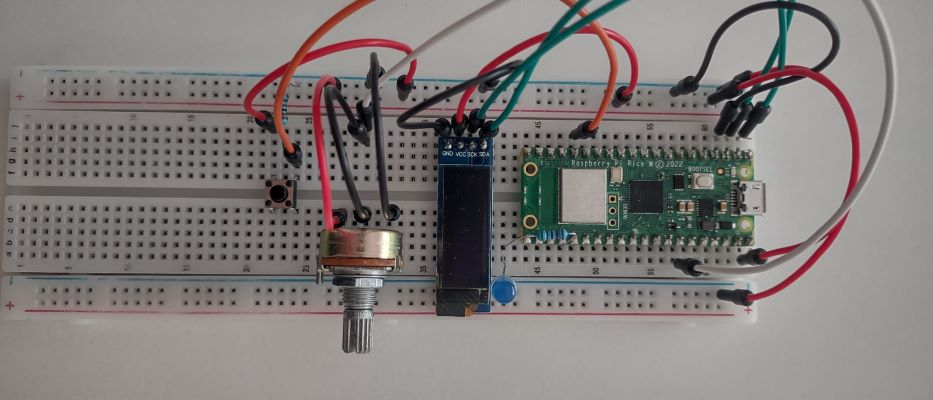
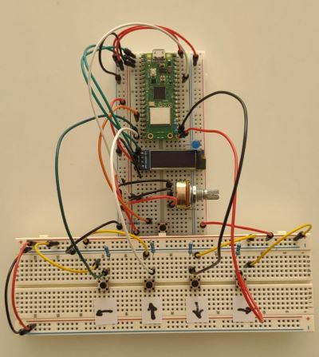

# pioneer bot

The objective of the robot is to travel from town to town while exploring new lands,
gathering resources to sell (Rocks, Wood and Fish) to the local communities and deposit the profits 
in the banks scattered in the settlements

The robot chooses the best course of action upon waking up in the morning (Praying status), tries to take on 
the selected tasks and then goes to sleep in its tent (JollyBlock which it carries around) as the night falls

The autopilot is mindful of things such as the weather (current and forecast) as
well as its own backpack and energy level

If that's not enough, at any point the user can intervene by plugging the 
raspberry pi pico (or any RP2040 board I suppose), programmed in rust to communicate 
via USB serial with the main program and interact with it

The code for the pico can be found in the [raspberry_pi_pico](raspberry_pi_pico/) folder.
Upon plugging the device in, the user is prompted to choose between the following two modes:

## Assisted mode

This is the main mode. The robot still functions on its own, but the user can intervene in the Praying phase, essentially 
suggesting what to do to for the day (answering the robot's prayers). If the robot can't carry out the selected operation, it will choose some more 
suitable course of action, as it would in autopilot

## Manual mode

the robot is fully controlled by the user via the makeshift controller. 4 additional buttons are added to it in order to 
collect user movement input, while the scroll wheel and confirmation button are still used to
select special actions like placing the tent, destroying content or using the spyglass to explore tiles. I could not manage to fit
them all on the same breadboard of the pico, apologies for the unnecessary size of the thing

# Remarks

- Beside the added functionalities, the main focus of the project, the AI, consists of the function 

`PioneerBot::auto_pilot(&mut self, world: &mut World, assisted: bool)`
- The folder [serial_test](serial_test) contains a couple of tests I used to check the USB functionality
- More info about the raspberry pi pico development can be found in [this file](raspberry_pi_pico/README.md)
- For the gui to work **on windows**, you need to place the .lib files contained in the latest releases at the following GitHubs:
  - [SDL2](https://github.com/libsdl-org/SDL)
  - [SDL2 Image](https://github.com/libsdl-org/SDL_image)
  - [SDL2 Text](https://github.com/libsdl-org/SDL_ttf)

  in the directory: 
  `C:\Users\{user}\.rustup\toolchains\{toolchain}\lib\rustlib\{toolchain}\lib\`

  and include the respective .dll files in the root directory of the program

  I can't include or link directly to the correct files because the toolchain in use might be different among
  different machines, but to clarify, these are all the files you should place in the directory stated above 
  - SDL2_ttf.lib
  - SDL2main.lib
  - SDL2test.lib
  - SDL2.lib
  - SDL2_image.lib
    
  and these are the files that need to be placed inside `pioneer_bot`
  - SDL2.dll
  - SDL2_image.dll
  - SDL2_tff.dll

# Issues
- Sometimes the robot gets stuck when going to its destination. This is due to NLA compass not working properly, as we concluded whilst talking to the group that created it to try and fix it. I added some workarounds and checks, but they can only go so far in minimizing the issue
- After gathering some content, especially Fish, the robot tries to collect more in the area with pmp_collect_all, but the tool gets stuck if the content is available in the area, but unreachable
- The spyglass sometimes returns the wrong tiles, meaning if the robot is searching for content and it thinks it found it, it will move to the location it thinks it found it at, only to find nothing
- When running the project, the startup time is considerable (2-3 minutes on average on my laptop). This is due to the oxidizing agents' audio tool
  - The function `PioneerBot::new(gui_start: bool, audio_start: bool)` allows for both gui and sound effects to be disabled, if some quick testing is required. You will find 3 `const` variables at the top of `main.rs`, feel free to edit those
- Note: while we as a group kept contact with NLA compass' developers to try and solve the issues at hand, the problems with spyglass and collect all have unfortunately arisen at the last possible minute, thus I personally wasn't able to contact them
- Anyway, if the robot gets stuck for any reason, it is designed to get a new objective each day, so there is a large probability that it will unstuck itself in a few ticks
  - Unless it is the collect all that caused it, because when the tool bugs out it locks the robot in an infinite loop **all inside the same tick**, so time doesn't go on and the only way to reset the robot is to CTRL+C
- As for my own faults, beside the challenges and issues reported on the raspberry pi pico side of things, the robot is a little buggy when interacting with markets and banks, due to me only getting to test this functionality as last
  - In particular, I don't think I have figured out the behaviour with depleted markets/banks quite right, ie when you can't keep using `put` on them
- Lastly, even though I planned for the game to end when the robot has depleted all markets or banks, I wasn't able to test it completely as it takes a while to explore the whole map, assuming it would be able to